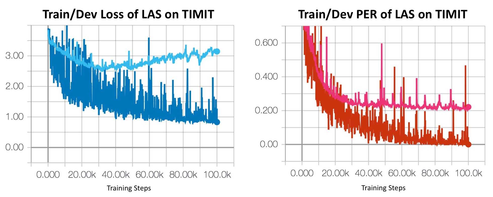
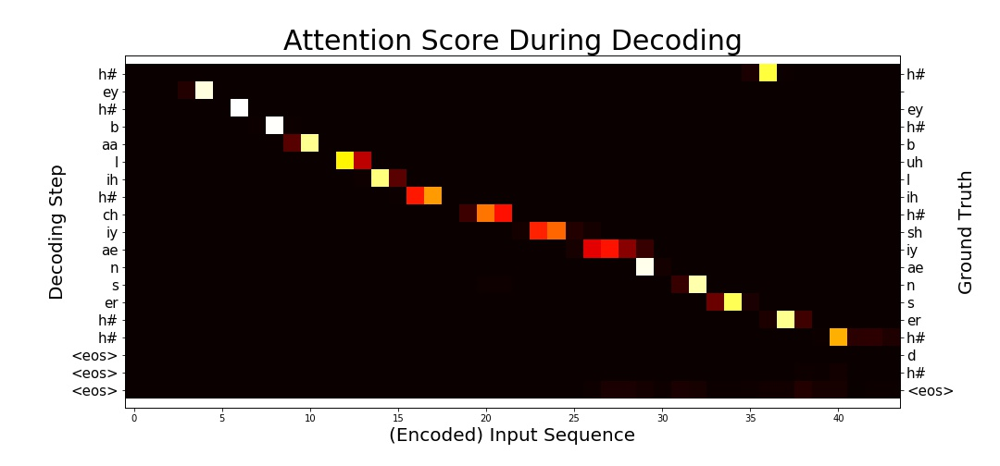

# Listen, Attend and Spell - PyTorch Implementation

## Description

This is a PyTorch implementation of [Listen, Attend and Spell](https://arxiv.org/abs/1508.01211v2) (LAS)  published in ICASSP 2016 (Student Paper Award) on [TIMIT](https://catalog.ldc.upenn.edu/ldc93s1) and [LibriSpeech](http://www.openslr.org/12/).
Feel free to use/modify them, any bug report or improvement suggestion will be appreciated. If you have any questions, please contact b03902034[AT]ntu.edu.tw

### TIMIT

The input feature is MFCC 39 (13+delta+accelerate), and the output phoneme classes is reduced from 61 to 39 classes during evaluation. This implement achieves about 26% phoneme error rate on TIMIT's testing set (using original setting in the paper without hyper parameter tuning, models are stored in [`checkpoint/`](checkpoint/)). It's not a remarkable score but please notice that deep end2end ASR without special designed loss function such as LAS requires larger corpus to achieve outstanding performance.

- Learning Curve



- Attention Visualization & Recognition Result


Result of the first sample in TIMIT testing set. Training log is availible in [here](log/), use ```tensorboard --logdir=las_example/``` to access.




### LibriSpeech

For LibriSpeech, the input feature is 40-dimensional log-mel filter bank computed every 10ms as specified in the original paper. The decoder is character based, outputting the distribution over 30 characters (including alphabet and punctuation).

##  Remarks

### Differences from the paper
Be aware of some differences between this implementation and the originally proposed model:
- Smaller Dataset

    Originally, LAS was trained on Google's private voice search dataset representing 2000 hours of data plus additional data augmentation. Here the model was trained on [TIMIT](https://catalog.ldc.upenn.edu/ldc93s1), a MUCH smaller dataset, without any data augmentation. Even LibriSpeech is relatively small corpus for LAS.

- Different Metric

    On TIMIT, the evaluation criterion we chose is the [Word Error Rate (WER)](https://en.wikipedia.org/wiki/Word_error_rate) of the output phoneme (i.e. phoneme error rate ) sequence instead of real sentences composed of real words.

- Simplified Speller

     Speller contains a single layer LSTM instead of 2 layer LSTM proposed. According to the response I got from a letter I wrote to the author, using single layer can get similar result.

- Features for character prediction

    According to Equation (8) in the paper, last layer of Speller takes both RNN output and attention-based context as input and output character distribution. However, the actual operation of this equation is unclear. In this implementation, RNN output and attention-based context are simply concatenated.

### Improvement

-   Multi-head Attention (MHA)

    Google had released another [paper](https://arxiv.org/abs/1712.01769) introducing state-of-the-art end2end ASR based on LAS. According to the paper, they modified the attention mechanism to MHA and gain remarkable performance improvement. We've implemented MHA as described in section 2.2.2. in the paper and enable it when training on LibriSpeech. It is worth to mention that MHA increases the training time of LAS (which was already too slow), so consider disable MHA by setting multi_head=1 in config on slower GPU.

-   Label Smoothing

    Like MHA, label smoothing was mentioned in the same [paper](https://arxiv.org/abs/1712.01769) and show significant improvement on LAS. However, pytorch's loss function design makes it difficult to implement label smoothing. In this implementation, label smoothing is achieved by self-defined loss function (can be found at [functions.py](util/functions.py)). The implementation may be numerical unstable comparing to native loss function provided by pytorch, you may disable label smoothing by setting it to 0 in config file. We will be very thankful for bug report or sugestion on label smoothing implementation.

## Requirements

### Execution Environment

- Python 3
- GPU computing is recommended for training efficiency
- Computing power and memory space (both RAM/GPU's RAM) is **extremely important** if you'ld like to train your own model, especially on LibriSpeech.


### Packages

- [SoX](http://sox.sourceforge.net/)

    Command line tool for transforming raw wave file in TIMIT from NIST to RIFF


- [python_speech_features](https://github.com/jameslyons/python_speech_features)

    A Python package for extracting MFCC features during preprocessing

- [pydub](https://github.com/jiaaro/pydub)

    High level api for audio file format tranlation

- [python_speech_features](https://github.com/jameslyons/python_speech_features)

    A Python package for extracting acoustic features during preprocessing

- joblib
    
    Parallel tool to speed up feature extraction/ dataset loading.

- tdqm

    Progress bar for visualization.

- [PyTorch](http://pytorch.org/) (0.4.0)

    Please use PyTorch 0.4.0 in where loss computation over 2D target is availible and the [softmax bug](https://github.com/pytorch/pytorch/issues/1020) on 3D input is fixed.


- [editdistance](https://github.com/aflc/editdistance)

    Package for calculating edit distance (Levenshtein distance).

- [tensorboardX](https://github.com/lanpa/tensorboard-pytorch)

    Tensorboard interface for pytorch, we used it to visualize training process.

- [pandas](https://pandas.pydata.org/)

    For LibriSpeech dataset loading.


## Setup
- TIMIT
    - Dataset Preprocess

        Please prepare TIMIT dataset without modifying the file structure of it and run the following command to preprocess it from wave to MFCC 39 before training.

            cd util
            ./timit_preprocess.sh <TIMIT folder>       

        After preprocessing step, `timit_mfcc_39.pkl` should be in your TIMIT folder. Add your data path to config file.

    - Train LAS
        Run the following commands to train LAS on TIMIT
            
            mkdir -p checkpoint
            mkdir -p log
            python3 train_timit.py <config file path>

        Training log will be stored at `log/` while model checkpoint at ` checkpoint/`

        For a customized experiment, please read and modify [`config/las_example_config.yaml`](config/las_example_config.yaml). For more information and a simple demonstration, please refer to [`las_demo.ipynb`](las_demo.ipynb)
    
- LibriSpeech


     LibriSpeech includes over 1000 hours of speech, **process it with powerful computer ( enough cores , large RAM and high-end GPU) is strongly recommanded.**

    -  Dataset Preprocess
    
        Download [LibriSpeech](http://www.openslr.org/12/) and extract it. Run the following command to process from wave to log-mel filter bank feature. 

            cd util
            ./librispeech_preprocess.sh <Absolute path to LibriSpeech folder> 

        Note that the script is an example using clean-100 dataset only. For more arguments and instruction preprocessing LibriSpeech, please run

            python3 util/librispeech_preprocess.py -h

        After preprocessing step, `train.csv`/`test.csv`/`dev.csv`/`idx2chap.csv` should be in your LibriSpeech folder. Extracted feature is stored in npy format. Raw wave file will also be availible (Speech signal of LibriSpeech comes in FLAC format).

    - LAS Model
        Run the following commands to train LAS on LibriSpeech  ​  

            mkdir -p checkpoint
            mkdir -p log
            python3 train_libri.py <config file path>

        Training log (access it with tensorboard) will be stored at `log/` while model checkpoint at ` checkpoint/`. For a customized experiment, please read and modify [`config/las_libri_config.yaml`](config/las_libri_config.yaml). 

## ToDo

- Supply experiment result of LibriSpeech dataset
- WSJ Dataset

## Acknowledgements
- Special thanks to [William Chan](http://williamchan.ca/), the first author of LAS, for answering my questions during implementation.
- Thanks [xiaoming](https://github.com/lezasantaizi), [Odie Ko](https://github.com/odie2630463) for identifying several issues in our implementation.

## References
- TIMIT preprocessing : https://github.com/Faur/TIMIT
